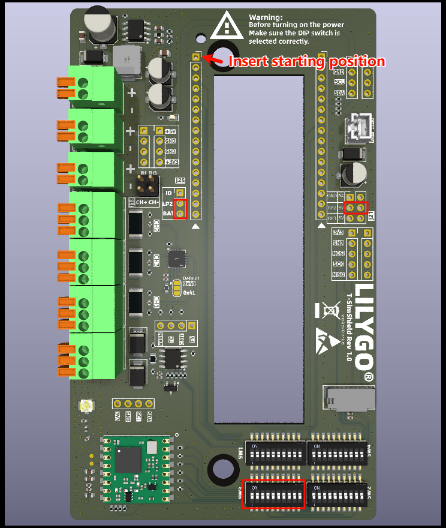
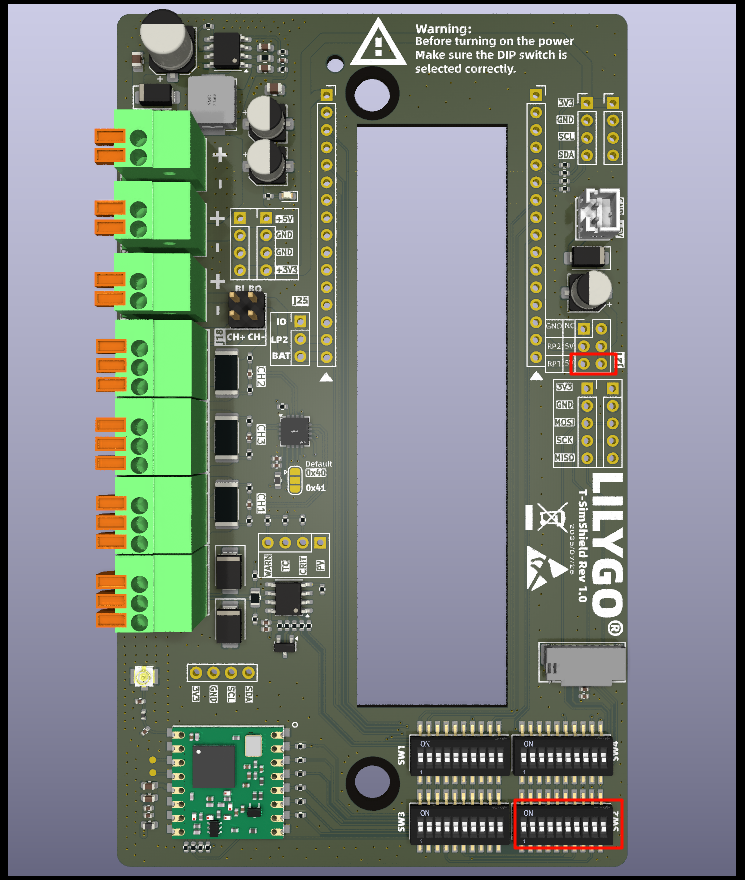

  

<h1 align = "center">🌟Sim Shield Usage Guide🌟</h1>

> \[!IMPORTANT]
>
> Warning: Jumper caps and DIP switches must be checked when power is on.
> Risk of damage if wrong selection is made
>

### ⚡ Electrical parameters

| Features                                | Details                       |
| --------------------------------------- | ----------------------------- |
| ⚡DC interface allows input voltage      | 7~36V                         |
| ⚡Battery interface allows input voltage | 4.2V                          |
| ⚡Charge Current                         | Provided by the motherboard   |
| ⚡+5V                                    | The maximum current can be 2A |
| ⚡+3V3                                   | Provided by the motherboard   |

* It is recommended not to connect the +3V3 pin to peripheral devices with a current exceeding 100mA, as different motherboards provide different currents.

## SIM7000G/A7670X/A7608X ESP32

1. **J25** short **IO** -> **LP2**
2. **J21** short **RP1** -> **5V**
3. **SW3** is turned to **ON**, and the remaining **SW1, SW2, and SW4** must not be in the ON position.

### Applicable Models

1. [SIM7000G-ESP32 Version](https://lilygo.cc/products/t-sim7000g?_pos=1&_sid=d79d65953&_ss=r)
2. [A7608X-ESP32 Version](https://lilygo.cc/products/t-a7608e-h?variant=43275846090933)
3. [A7670X-ESP32 Version](https://lilygo.cc/products/t-sim-a7670e?_pos=1&_sid=f2986df37&_ss=r&variant=42534734495925)

## SIM7600X ESP32

1. **J25** short **IO** -> **BAT**
2. **J21** short **RP2** -> **5V**
3. **SW3** is turned to **ON**, and the remaining **SW1, SW2, and SW4** must not be in the ON position.

> \[!IMPORTANT]
> The SIM7600 pin header is 15 pins, and the insertion position must be where the arrow points.
>

### Applicable Models

1. [SIM7600X-ESP32 Version](https://lilygo.cc/products/t-sim7600?_pos=1&_sid=7474cd3cf&_ss=r&variant=42358717939893)

## SIM7670G ESP32S3

1. **J25** short **IO** -> **LP2**
2. **J21** short **RP1** -> **5V**
3. **SW2** is turned to **ON**, and the remaining **SW1, SW3, and SW4** must not be in the ON position.

### Applicable Models

1. [SIM7670G-ESP32S3 Version](https://lilygo.cc/products/t-sim-7670g-s3?_pos=1&_sid=2be878e69&_ss=r)

## A7608X ESP32S3

1. **J25** short **IO** -> **LP2**
2. **J21** not connected to any
3. **SW2** is turned to **ON**, and the remaining **SW1, SW3, and SW4** must not be in the ON position.

### Applicable Models

1. [A7608X-ESP32S3 Version](https://lilygo.cc/products/t-a7608e-h?_pos=1&_sid=e4fd02f43&_ss=r)

## SIM7080G ESP32S3

1. **J25** not connected to any
2. **J21** not connected to any
3. **SW4** is turned to **ON**, and the remaining **SW1, SW2, and SW3** must not be in the ON position.

> \[!IMPORTANT]
>
> 1. The SIM7080G-ESP32S3 version does not expose the battery external pin. The battery external function of SimShield cannot be used. The positive pole of the 18650 battery holder needs to be welded to the left pin.In the picture, +BAT points to the welding direction of the positive pole of the battery.
> 2. The SIM7080G-ESP32S3 version has an onboard 18650 battery holder that conflicts with SimShield. The battery holder must be removed before installation
>

### Applicable Models

1. [SIM7080G-ESP32S3 Version](https://lilygo.cc/products/t-sim7080-s3?_pos=1&_sid=7d3cc194f&_ss=r)

## Monitor battery charging and discharging jumper settings

* The vertical jumper cap in the figure below routes the battery current to INA3221 channel 2, and the battery charging and discharging current can be monitored by reading the INA3221 sensor. **At this time, do not connect anything to the crimp terminal interface.**
* If the jumper cap is not connected, the crimp terminal interface current is monitored

## 5V 2.00mm 2Pin power supply interface

* This interface is used to supply external power and has no other functions.

## SD interface

* SimShield remaps the SPI interface. After using SimShield, do not insert the SD card into the motherboard. Instead, insert the SD card into SimShield.

## RS485 interface

* RS485 uses hardware automatic sending and receiving control, and it is recommended to use a communication baud rate below 115200

## I2C interface

* [0.96-inch OLED display](https://lilygo.cc/products/0-96-inch-oled?_pos=1&_sid=61234aa32&_ss=r)
* The I2C interface is suitable for OLED screens connected to conventional interfaces. Please note that the OLED interface has two line sequences. Please make sure that the line sequence is correct. Please refer to this [link](https://lilygo.cc/products/0-96-inch-oled?_pos=1&_sid=61234aa32&_ss=r) for the OLED interface

## SPI interface

* SPI interface exposes the SPI bus interface of SD card/Radio
